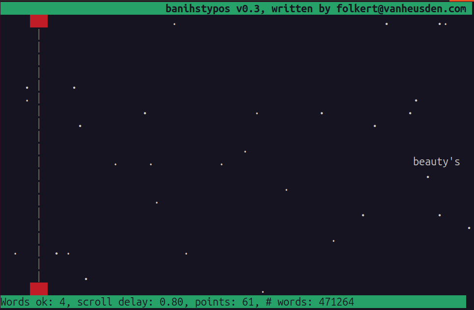

banihstypos helps you learning to type fast.

installation:
------------
type:
	make

and that's it!

You need to have 'libncurses5-dev' installed.

usage:
-----
By default, the program looks in /usr/share/dict for a dictionary-file.
If none is found, you can select one with '-f'.

screenshot:
----------

license:
-------
MIT

For everything related to 'banihstypos', please feel free
to contact me on: mail@vanheusden.com
